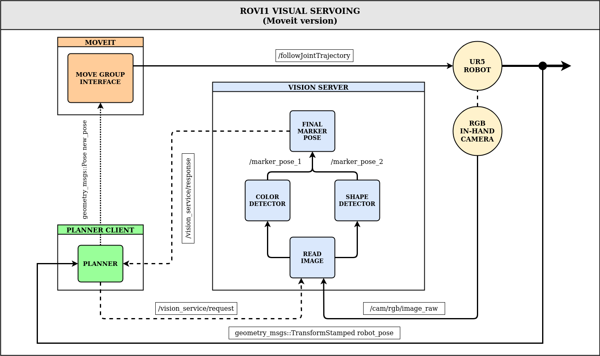

# ROVI1 Visual Servoing

This repository contains the final project for ROVI 1 (SDU). The project consisted on a visual servoing application based on color markers with random backgrounds. This is an example on how to do it using ROS tools such as _Gazebo_, _Rviz_ and _MoveIt!_. Original project uses RobWork and RobWorkStudio (see [this](https://github.com/CVH95/Verona/tree/robwork-devel) branch).


## Instal instructions

Install catkin tools (python):

```sh
sudo apt install python-catkin-tools
```

Then clone and install dependencies:

```sh
cd ~
mkdir -p rovi1_ws/src && cd rovi1_ws/src
git clone <url>

# Install dependencies via rosinstall and rosdeo
wstool update
cd ..
rosdep update
rosdep install -i --from-paths src/ -y -r

# Build
catkin init
catkin build
```

## Usage instructions

On separate terminals:

```sh
# Launch simulated scene
roslaunch rovi1_demo_manager scene_gazebo.launch

# Launch server interface
roslaunch rovi1_demo_manager vision_server.launch

# Launch client interface
roslaunch rovi1_demo_manager planner.launch
```

- - -

**NOTE:** There is a predefined RVIZ configuration in rovi1_demo_manager/config/default.rviz, which has default windows to show result-detection images, as well as relevant frames.

- - -

## System Overview



## Packages and classes

- `gazebo_models`: Configuration and mesh files to implement the model of the wall with the cathedral window background.
- `planning_servoing` package.
  - Class list:
    - `Planner`: Planning class interfacing _Moveit_ to create a visual servoing loop.
  - Node list:
    - `planning_servoing_node`: Main node running `Planner` class.
    - `marker_trajectory_node`: Node to move the marker the scene (triangle and rectangle trajectories).
- `perception_servoing`: Shared library with detection methods.
- `rovi1_demo_manager` package. Main running interface of the application. Configuration files (in `YAML` format), as well as `launch` files for all the several nodes of the system are in this packages.
- `vision_interface` stack. Interface implementing a server architecture for the vision part.
  - `vision_lib_msgs` package: Definition of the request and response messages of the service.
  - `vision_server_ros` package: Class implementing the server. It subscribes to image stream only when the service is called, and uses `perception_servoing` lib to detect the marker.
- `workcell_scene_description` package: URDF files of the components and description of the workcell.
